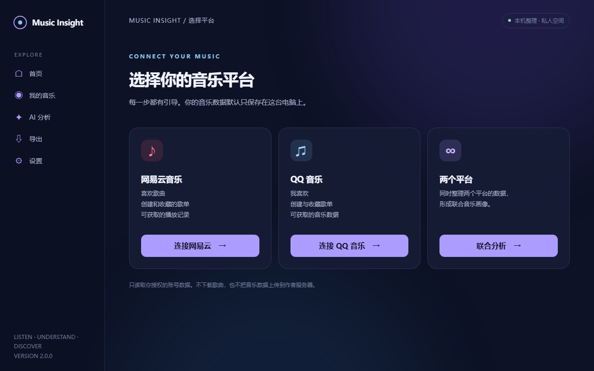
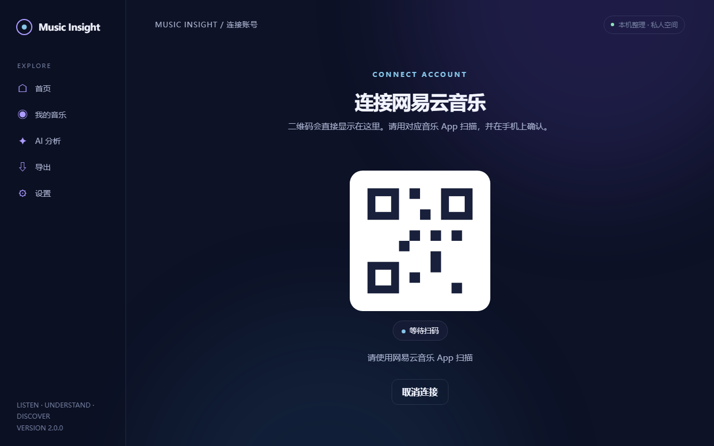
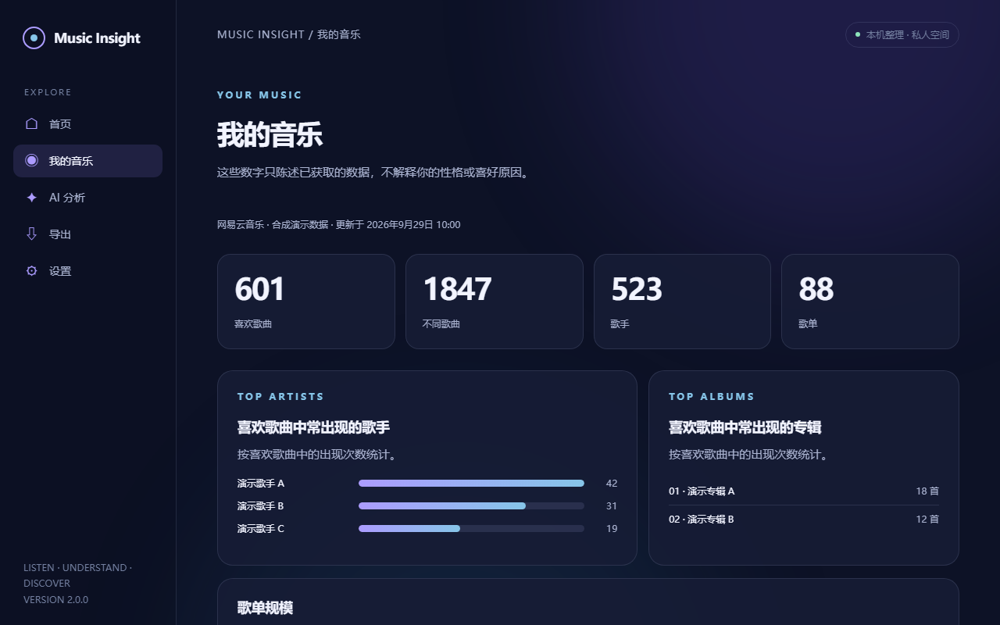
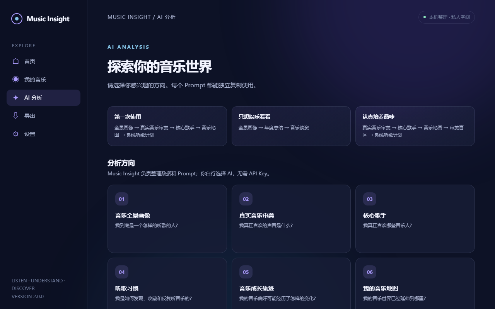

# 🎧 Music Insight

## 听见自己。

**网易云音乐 / QQ 音乐个人音乐数据与 AI 音乐审美探索工具。**

一键整理两个平台的个人听歌数据，通过可视化和模块化 AI Prompt，帮助你理解自己的音乐习惯与音乐审美。

[下载 Windows 版](https://github.com/rhr-jz/netease-music-insight/releases/latest) · [快速开始](docs/QUICK_START.md) · [常见问题](docs/FAQ.md) · [English](README_EN.md)

## 界面截图

以下均为**合成演示数据**。登录图中的图案不是有效登录二维码，截图不包含真实账号、歌单或凭据。

| 首页 | 连接音乐平台 |
| --- | --- |
|  |  |

| 应用内扫码 | 我的音乐 Dashboard |
| --- | --- |
|  |  |



## 它能做什么

- **连接网易云音乐、QQ 音乐或两个平台**：在应用内扫码，整理喜欢歌曲、自建与收藏歌单、可访问的歌单歌曲。网易云还会尝试读取平台当前提供的播放记录。
- **查看音乐事实**：Dashboard 展示喜欢歌曲、去重歌曲、歌手、歌单、常出现歌手与专辑、数据来源和更新时间；本地搜索歌曲、歌手与专辑。
- **探索 AI 分析**：按主题查看完整 Prompt，一键复制，再把导出的数据交给你选择的 AI。两个平台的数据会增加跨平台分析。
- **导出可复用文件**：生成 `music_for_ai.json`、`music_summary.md`、`AI_ANALYSIS_GUIDE.md` 和独立的 `prompts/`。联合数据使用 `music_for_ai_combined.json`。
- **离线浏览历史结果**：已有导出可在断网时查看、搜索和复制 Prompt；重新同步音乐平台需要网络。

项目最初只支持网易云音乐，因此仓库名仍是 `netease-music-insight`；现在产品名称统一为 **Music Insight**，并支持 QQ 音乐与联合分析。

## Windows 快速开始

1. 从 [最新 GitHub Release](https://github.com/rhr-jz/netease-music-insight/releases/latest) 下载带桌面界面的 `MusicInsight-Windows-Portable.zip`，**完整解压**。
2. 双击文件夹中的 `MusicInsight.exe`。
3. 选择网易云音乐、QQ 音乐或“两个平台”。
4. 用对应的音乐 App 扫描应用内二维码，并在手机确认。
5. 点击“开始整理我的音乐”，随后在“我的音乐”和“AI 分析”中探索。

Windows 10/11 需要 Microsoft Edge WebView2 Runtime。首次整理网易云音乐时，程序可能需要联网准备本地接口组件；请保留解压后的整个目录，不要单独移动 EXE。各 Release 的实际功能以对应版本说明为准。[下载被拦截时的处理方法](SECURITY.md)。

## Local Web

**Music Insight Web 是运行在你电脑上的 Local Web，不是云端 SaaS。** 网页由本机 Python 后端提供，默认只监听 `127.0.0.1` 的随机空闲端口；程序启动后自动打开系统默认浏览器。音乐数据不会默认上传到作者服务器，其他局域网设备也不能直接访问这个地址。

- 在包含该功能的桌面版中，打开“设置” → “启动 Web 版”。
- 源码用户可运行 `python run_web.py`；浏览器会自动打开。
- Web 与 Desktop 共用同一套登录、导出、Dashboard 和 Prompt 逻辑。网页版可直接下载当前导出的 JSON、摘要与指南。

Local Web 在窄屏浏览器也可阅读，但由于服务只绑定本机，**手机无法直接通过局域网访问电脑上的网页**。请在电脑上打开页面，用手机扫描电脑屏幕中的二维码。[架构与安全边界](docs/ARCHITECTURE.md)。

## AI 分析中心

可选择：音乐全景画像、真实音乐审美、核心歌手、听歌习惯、音乐成长轨迹、我的音乐地图、审美盲区、同龄人音乐谈资、系统听歌计划、歌单整理、情绪与音乐、年度音乐总结；有两个平台数据时还可进行跨平台比较。

**无需 OpenAI、Claude 或 Gemini API Key。** 使用方式：

```text
Music Insight 整理数据 → 选择分析方向 → 复制 Prompt
                                 ↓
       自行把数据文件和 Prompt 交给 ChatGPT / Claude / Gemini 等 AI
```

每个 Prompt 可独立使用，并会说明缺失的数据。QQ 音乐没有可靠的完整播放历史时，不会把“历史缺失”误写成“没有重复听歌”。[了解分析方向与数据边界](docs/AI_ANALYSIS.md)。

## 数据与隐私

> 🔒 **Privacy First：你的音乐数据默认只保存在本地。**

Music Insight 不获取账号密码，不把 Cookie 上传到作者服务器，不默认上传个人歌单，不下载版权音乐，不绕过 VIP 或破解付费内容。扫码后与音乐平台通信是获取你授权数据所必需的；**只有你主动把导出文件上传给所选 AI，AI 服务才会收到这些数据**。

播放记录与收藏时间以平台实际返回为准。网易云返回的播放记录可能只覆盖有限范围；QQ 音乐完整播放历史当前不可用。缺失或无法访问的内容会在导出中标记。[完整隐私说明](PRIVACY.md) · [数据格式](docs/DATA_FORMAT.md)。

## 常见问题

- **二维码过期？** 在应用内点击“重新生成”，用对应平台 App 重新扫码。
- **下载提示风险？** 不要关闭防护或强行运行；核对 Release 来源并阅读[下载与安全说明](SECURITY.md)。
- **为什么有歌曲、歌单或历史缺失？** 平台接口、权限和下架内容都可能影响范围；详见[常见问题](docs/FAQ.md)。
- **哪里反馈问题？** 到 [Issues](https://github.com/rhr-jz/netease-music-insight/issues) 描述系统、版本和复现步骤，不要上传 Cookie、UID、二维码或私人导出文件。

## 开发者运行方式

需要 Python 3.10+。Windows 桌面源码版依赖 `requirements-desktop.txt`；CLI 与 Local Web 的基础依赖见 `requirements.txt`。网易云导出在 macOS / Linux 上还需要 Node.js 18+。

```bash
python -m pip install -r requirements-desktop.txt
python run_desktop.py                 # Windows GUI
python run_web.py                     # Local Web
python run.py --provider netease      # CLI；也支持 qq / all
python -m unittest discover -s tests -v
```

macOS 源码版可双击 `一键运行.command`；Windows 源码版保留 `一键运行.bat`。自动化与进阶用法见[开发文档](docs/DEVELOPMENT.md)。

## 项目结构

```text
netease_music_insight/
  providers/             网易云与 QQ 音乐数据接口
  desktop/               桌面 Bridge 与共享页面
  web/                   仅本机访问的 HTTP 适配层
  service.py             Desktop / Web / CLI 共用的任务编排
  guidance.py            共用的 AI Prompt 数据源
assets/screenshots/       无真实账号信息的产品截图
docs/                     快速开始、分析、隐私、架构与开发文档
tests/                    离线测试
run_desktop.py · run_web.py · run.py
```

界面与 Core 共用一套业务逻辑，桌面和网页共用同一份 HTML/CSS/JS。[完整架构](docs/ARCHITECTURE.md)。

## License

本项目按 [GPL-3.0-or-later](LICENSE) 发布。第三方组件与许可见 [THIRD_PARTY_LICENSES.md](THIRD_PARTY_LICENSES.md)；下载安全说明见 [SECURITY.md](SECURITY.md)。本项目与网易云音乐、QQ 音乐及其关联公司无官方关系，仅供整理自己有权访问的账户数据。
