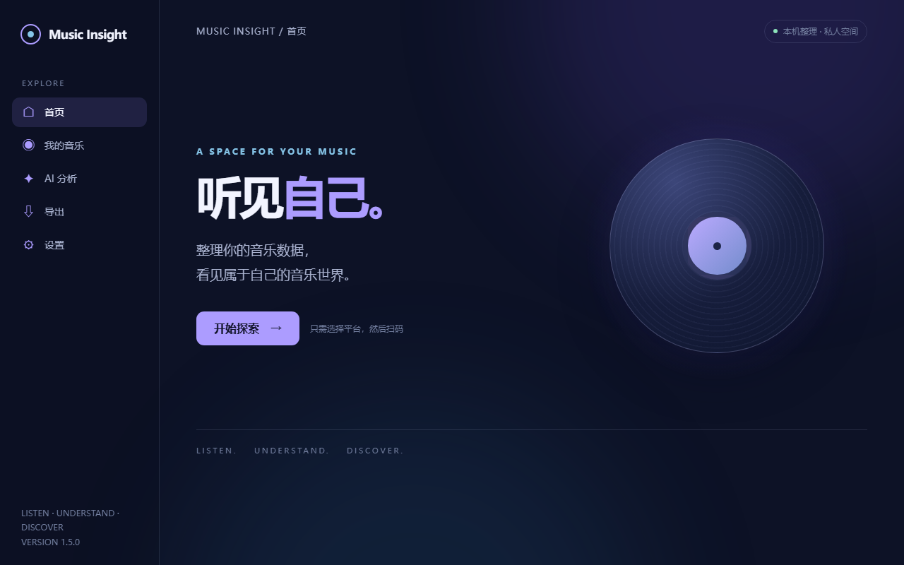

# Music Insight

Export your NetEase Cloud Music or QQ Music account metadata and turn it into an AI-ready personal music profile.

On Windows 10/11, download a GUI version of the portable ZIP from [Releases](https://github.com/rhr-jz/netease-music-insight/releases), extract it, and run `MusicInsight.exe`. Choose a platform and scan the QR code inside the window; older releases still use the CLI. The GUI needs Microsoft Edge WebView2 Runtime. Alternatively, install Python 3.10+, download this repository, and run `python run_desktop.py` after installing `requirements-desktop.txt`; `python run.py` remains the CLI. If security software reports a threat, do not bypass the block; see [download security](SECURITY.md).

On macOS, install [Python 3.10+](https://www.python.org/downloads/macos/), download and extract the repository ZIP, then double-click `一键运行.command`. NetEase exports additionally require [Node.js 18+](https://nodejs.org/); QQ Music does not. The launcher prepares an isolated Python environment on first run. Select a platform, scan the QR code in its music app, and use the completion menu to reveal the output folder in Finder.

On Linux, install Python 3.10+ (and Node.js 18+ for NetEase), create a virtual environment, install `requirements.txt`, and run `python run.py`. The desktop opener uses `xdg-open` when available.

The tool exports liked songs and accessible playlists from either platform, plus playback records currently available from NetEase. It writes `music_for_ai.json`, `music_summary.md`, `AI_ANALYSIS_GUIDE.md`, and individual prompts. NetEase keeps its original `output/<nickname>_<uid>/` path; QQ uses `output/qq_music/<nickname>_<uid>/`. A joint profile is written to `output/combined/` when both platforms succeed.

The Windows desktop app restores previous exports offline, shows factual Dashboard statistics and local music search, and lets you read and copy independent prompts in its AI Center. You choose any AI that accepts file uploads; no API key is needed.

**Local Web:** In a desktop build that includes the feature, open Settings and choose “启动 Web 版”, or run `python run_web.py` from source. The app opens the default browser on a random `127.0.0.1` port. It runs on your computer, not on an author-hosted website; other devices on your LAN cannot access it by default. Desktop and Web share the same Python Core, dashboard, and prompts. The Web interface can download the currently selected export files. See [quick start](docs/QUICK_START.md) and [architecture](docs/ARCHITECTURE.md).

**NetEase playback records are limited by what its service returns; QQ playback history has no verified reliable endpoint and is marked unavailable.** Collection and playlist timestamps are included only when the API actually returns a usable value. QQ's favorite-playlist order time is labeled separately because it may differ from the original subscription date. The exporter records inaccessible playlists and other gaps in `export_meta.issues`.

Your music data stays on your computer by default. QR credentials live only in memory during the session. This independent project uses unofficial interfaces that can change. QQ support uses [QQMusicApi](https://github.com/L-1124/QQMusicApi) (GPL-3.0-or-later); see [licenses](THIRD_PARTY_LICENSES.md), [privacy](PRIVACY.md), [data format](docs/DATA_FORMAT.md), and [FAQ](docs/FAQ.md).
