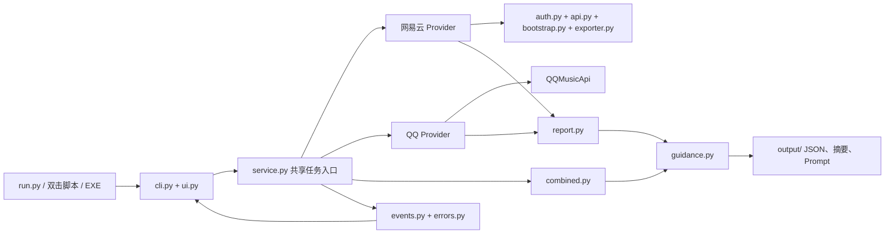

# GUI / Local Web 架构准备（第 1 阶段）

> 历史记录：本文保留第 1 阶段的选型与计划，其中“Web 尚未实现”和 FastAPI 方案已过时。当前实现见 [项目架构](../ARCHITECTURE.md)。

第 1 阶段保留现有 `netease_music_insight/` 包与 JSON 格式，不迁移到 `src/`。第 2 阶段已加入 pywebview 桌面界面；独立网页端仍未实现。

## 现有链路与解耦

网易云经本机 `127.0.0.1` Node 接口扫码，使用 24 小时缓存读取喜欢歌曲、歌单及可返回的播放记录。QQ 使用异步 QQMusicApi，同样有缓存；播放历史仍标记不可用。`report.py`、`combined.py`、`guidance.py` 是单一的数据、联合匹配与 Prompt 实现。Windows PyInstaller 标签发布和三系统测试仍沿用原工作流。

原有耦合是 CLI 直接编排 Provider 与联合导出、Provider 自行打开二维码、网易云过期时调用 `input()`、进度靠中文字符串解析。现在 `MusicInsightService` 是共同任务入口；CLI 只负责选择、重试、展示、日志。二维码展示及过期决定由调用方回调提供。Core 发出 `MusicEvent`，路径与统计可由 GUI/Web 适配。旧 Provider 消息暂由 `service.py` 转换为结构化事件，后续可逐步替换，不动抓取逻辑。

事件覆盖 `login_qr_ready`、`login_waiting`、`login_scanned`、`login_confirming`、`login_success`、`login_failed`、`export_started`、`profile_done`、`liked_songs_done`、`playlists_progress`、`playlist_tracks_progress`、`history_progress`、`statistics_done`、`export_finished`、`export_failed`、`export_cancelled`。缺少可靠数量时 `current` / `total` 为空。错误类型包含 `LoginFailure`、`NetworkUnavailable`、`ProviderUnavailable`、`PlaylistUnavailable`、`ExportFailed`、`ExportCancelled`；原始异常链留给日志。单个不可访问歌单依原逻辑记入 `issues`，继续导出。

## 桌面 GUI 技术比较

以下均针对当前 Python Core 和 Windows 目录版发布；包大小是相对预期，需真实构建测量。

**PySide6 / Qt**：直接集成 Python，`QThread`/Signal 适合后台进度；中文控件、二维码显示和高 DPI 支持成熟。[官方线程示例](https://doc.qt.io/qtforpython-6/examples/example_widgets_thread_signals.html)与[高 DPI 说明](https://doc.qt.io/qtforpython-6/overviews/qtdoc-highdpi.html)支持这些判断。Windows 打包需带 Qt 库及插件，预计较重；网页还要维护另一套 UI。[部署文档](https://doc.qt.io/qtforpython-6/deployment/index.html)

**Flet**：Python 控件可生成桌面与动态网页，界面、中文、缩放、二维码及进度都适合；但 Windows 构建引入 Flutter，增加构建与维护成本。[Flet 发布文档](https://flet.dev/docs/publish/) 静态网页使用 Pyodide，无法直接承担当前本地 Node 启动和 QQ 原生依赖；实际仍需本地 Python 服务。[Web 模式](https://flet.dev/docs/publish/web/)

**pywebview + 本地网页（选定）**：Windows 窗口可沿用 Python/PyInstaller 打包方向，复用 Local Web 的 HTML/CSS/JS。依赖系统 WebView2，预计比捆绑 Qt/Flutter 轻，但须在目标 Windows 上验证 Runtime、安装包大小、中文和 125%/150%/200% 缩放。[安装](https://pywebview.flowrl.com/3.7/guide/installation.html)、[打包](https://pywebview.flowrl.com/guide/freezing)、[本地服务架构](https://pywebview.flowrl.com/3.7/guide/architecture.html)。二维码可作为受保护的本地资源显示，工作线程通过事件队列更新页面。代价是增加浏览器前端和安全的本地 API。

**Tauri + Python sidecar**：网页 UI 可复用，系统 WebView 的中文、高 DPI 与二维码能力也适合；但 Windows 打包需另封装 Python sidecar，并协调 Rust/Tauri 与 Python 的进程和跨系统二进制，当前项目的开发及长期维护成本最高。[Tauri sidecar 文档](https://v2.tauri.app/develop/sidecar/)

最终选择 **pywebview 桌面壳 + Python Core**。第 2 阶段桌面界面以内联 HTML 加载，不启动 HTTP 服务；Web 端仍属后续阶段。CLI 保留，Windows 发布包改为图形主入口。

## Local Web 与隐私边界

计划使用 FastAPI + Uvicorn：随机端口、仅绑定 `127.0.0.1`；浏览器与 pywebview 访问同一页面，使用 WebSocket 传事件。[FastAPI WebSocket 文档](https://fastapi.tiangolo.com/advanced/websockets/) Cookie、Token、UID、歌单和完整听歌数据默认留在本机。纯浏览器无法安全完成的扫码步骤仍交给本机 Python Core，绝不转发给作者服务器。

落地时必须生成会话密钥，检查 Host/Origin 与 CSRF；仅提供固定静态资源，禁止第三方脚本与任意文件路径读取。QR 图片在 `login_qr_ready` 回调时读入短时内存，过期立即清除；不能把临时路径当成永久 URL。浏览器只收到任务状态与必要的本地展示信息，绝不收到 Cookie/Token。关闭程序时销毁登录凭据、二维码资源与本地服务；不得监听 `0.0.0.0` 或默认开放局域网。

## 后台任务与取消

每次只运行一个导出任务。GUI 主线程仅绘制，Worker Thread 执行 `MusicInsightService`；QQ 的 `asyncio.run` 只在 Worker 内部运行。Bridge 用锁保护状态快照，窗口定时读取进度，因此抓取时仍可拖动、最小化和查看进度。取消按钮已接入 `CancellationToken`，在 Service、二维码轮询、QQ 请求边界及 Provider 通知点协作取消；网络请求不会被强行杀死，需待当前请求超时或返回后执行清理。已导出数据和缓存不会因取消而主动删除。

## 桌面实现

`run_desktop.py` 启动 `desktop/app.py`，窗口通过 pywebview 的本机 JS API 访问 `desktop/bridge.py`。Bridge 以后台线程调用同一个 `MusicInsightService`，把扫码图片读为内存中的 Data URL，按事件更新连接、进度和结果页面；数据文件仍由原 Provider、报告和指南模块生成。窗口关闭及“取消”按钮使用同一个协作取消令牌。第 3 阶段的 `desktop/library.py` 从既有 JSON 恢复本地 Dashboard、历史来源和 AI 分析卡片；Prompt 始终由共享 `guidance.py` 生成，复制使用 Windows 原生 Unicode 剪贴板。WebView2 Runtime 是 Windows 运行依赖；不需要本地 HTTP 端口。Web 端留待后续阶段。数据格式详见[数据格式](../DATA_FORMAT.md)。
